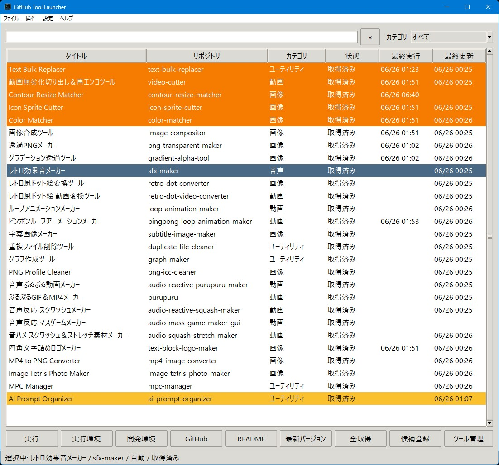

# GitHub Tool Launcher



## 機能概要

GitHubで管理している自作ツールや小物アプリを、一覧からすぐ起動できるWindows向けランチャーです。
実行用リポジトリと開発用リポジトリを分けて管理できるので、「起動するだけの環境」と「編集する環境」を混ぜずに扱えます。

### 主な機能

* GitHubリポジトリ単位でツールを一覧管理
* ツール名、リポジトリ名、実行スクリプト、カテゴリ、タグ、実行方法を登録
* 検索ボックスでツールを絞り込み
* 一覧をダブルクリック、または `[実行]` ボタンでツールを起動
* 実行環境フォルダと開発環境フォルダを別々に開ける
* GitHubページ、READMEをすぐ開ける
* `_repository_実行環境` に実行用リポジトリを clone / pull
* 「最新バージョン」取得、全リポジトリ一括取得に対応
* GitHubユーザIDから公開リポジトリ一覧を取得して、チェックしたものだけ候補登録
* README.md の最初の `# 見出し` を読み取ってツールタイトルに自動設定
* 実行スクリプト候補をリポジトリ内から自動検出
* 1〜9キーで行ラベル色を設定、0キーで解除
* ラベル管理で文字色・背景色を編集可能
* 文字サイズを 9pt〜25pt で変更可能
* ウィンドウ位置・サイズ、文字サイズ、環境設定を保存
* 日本語パス対応
* exe化用のビルドスクリプト付き
* GUIは Tkinter 製
* FFmpegは不要

### 一言で言うと

「GitHubで管理している自作ツールをまとめて起動・更新するランチャー」

## 使い方

### 1. アプリを起動する

Python版を使う場合は、ターミナルで以下を実行します。

```bash
python github-tool-launcher.py
```

exe版を使う場合は、ビルド済みの `github-tool-launcher.exe` を起動してください。

Python版の実行に追加ライブラリは基本的に不要です。
ただし、exe化する場合は `pyinstaller` が必要です。

```bash
pip install pyinstaller
```

### 2. 環境設定を行う

メニューの `設定 > 環境設定` から、以下を設定します。

* GitHubユーザID
* 開発環境パス

例：

```text
GitHubユーザID: your-github-id
開発環境パス: C:\Documents\GitHub
```

このツールでは、実行用のリポジトリはランチャーと同じフォルダ内の `_repository_実行環境` に保存されます。
開発用のリポジトリは、設定した開発環境パス内にあるものとして扱います。

### 3. ツールを登録する

登録方法は2つあります。

#### 手動で登録する

`設定 > ツール管理` から、以下を入力して登録します。

* タイトル
* リポジトリ名
* 実行スクリプト
* カテゴリ
* タグ
* 実行方法

実行スクリプトには、リポジトリ内の相対パスを指定します。

例：

```text
github-tool-launcher.py
tools/main.py
start.bat
app.exe
```

#### GitHubから候補登録する

`設定 > GitHub候補登録` から、GitHubユーザIDに紐づく公開リポジトリ一覧を取得できます。
登録したいリポジトリにチェックを入れると、そのリポジトリだけを登録します。

候補登録時には、リポジトリを取得したあとに README.md を確認し、最初に見つかった `# 見出し` をタイトルとして使います。

### 4. ツールを実行する

一覧からツールを選択して、`[実行]` ボタンを押します。
一覧をダブルクリックしても実行できます。

実行方法は以下から選べます。

* 自動
* python
* pythonw
* bat/cmd
* exe
* 任意コマンド

GUIツールの場合は `pythonw` を使うと、黒いコマンドプロンプトを出さずに起動しやすくなります。

### 5. リポジトリを更新する

選択中のツールを更新する場合は、`[最新バージョン]` を押します。

未取得の場合は clone、取得済みの場合は pull を行います。

```text
未取得: git clone
取得済み: git pull --ff-only
```

登録済みツールをまとめて更新したい場合は、`[全取得]` を使います。

### 6. フォルダやGitHubページを開く

メイン画面のボタンから、関連する場所をすぐ開けます。

* `[実行環境]`
  `_repository_実行環境` 内の実行用リポジトリを開きます。

* `[開発環境]`
  設定した開発環境パス内のリポジトリを開きます。

* `[GitHub]`
  対象リポジトリのGitHubページを開きます。

* `[README]`
  ローカルREADMEがあれば開き、なければGitHub側のREADMEを開きます。

実行環境フォルダを開くと、目印として `__ここは実行環境です.txt` が作成されます。
開発環境と間違えにくくするための目印です。

### 7. ラベル色を設定する

一覧でツールを選択した状態で、キーボードの `1`〜`9` を押すとラベル色を設定できます。
`0` を押すとラベルを解除します。

ラベル色は `設定 > ラベル管理` から変更できます。

### 8. 文字サイズを変更する

`設定 > 文字サイズ` から、9pt〜25pt の範囲で表示文字サイズを変更できます。
設定は保存され、次回起動時にも復元されます。

## exe化について

`build-github-tool-launcher.bat` を実行すると、PyInstallerでexe化できます。

```text
build-github-tool-launcher.bat
```

ビルド後は、同じフォルダに配布用ZIPが作成されます。
一時生成された build / dist / spec などは削除され、ZIPだけが残ります。

## 必要環境

* Windows
* Python 3.10以上
* Git
* PyInstaller ※exe化する場合のみ

Python版をそのまま使うだけなら、追加ライブラリは基本的に不要です。

exe化する場合：

```bash
pip install pyinstaller
```

また、登録したツールがPythonスクリプトの場合は、そのツールを実行するPC側にもPython環境が必要です。

## ライセンス

**MIT License** で公開しています。
ご自由に使って、改変して、参考にしてください。
ただし**自作発言はNG**でお願いします。
